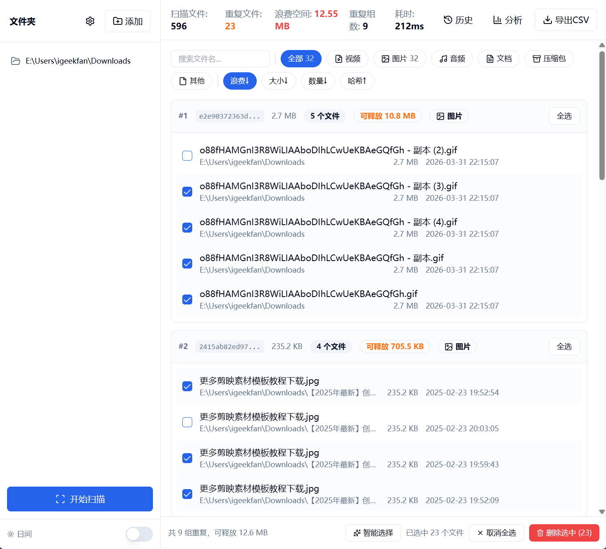
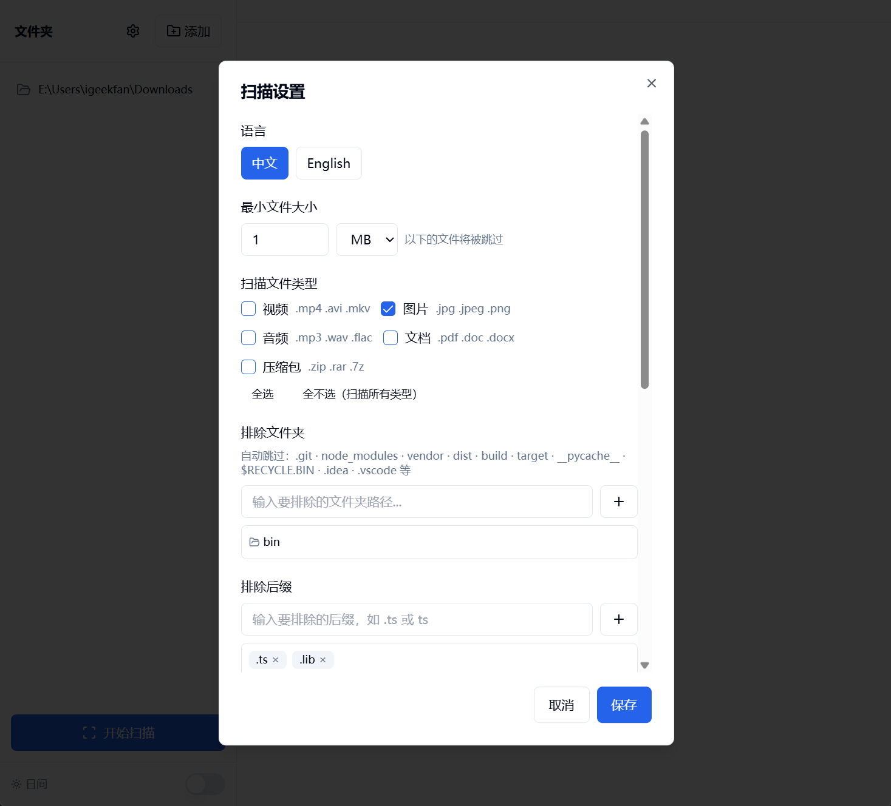

# FT

[English](README.md) | [简体中文](README.zh-CN.md)

FT 是一个跨平台桌面文件查重工具，适合清理重复文件、整理同名文件，以及快速查看重复内容带来的空间浪费。

## 功能概览

- 多文件夹扫描，内置文件浏览器，便于快速选择磁盘和目录
- 支持按内容查重和按文件名查重，覆盖精确去重与同名整理两类场景
- 支持文件类型筛选、最小文件大小、排除目录、排除后缀、隐藏文件开关和符号链接策略
- 支持并行扫描、实时进度日志、暂停、继续和取消，适合大目录长时间任务
- 支持 xxHash / MD5 和大文件采样模式，在速度与兼容性之间自由选择
- 重复结果支持分组展示、搜索、排序、分页和按文件夹快速筛选
- 提供图片、视频、音频预览，可直接打开文件或定位到所在目录
- 提供智能选择、批量选择与安全删除，支持回收站删除或直接删除
- 内置扫描历史，可回看并恢复之前的扫描结果
- 支持磁盘空间分析，按文件类型查看重复文件数量与浪费空间
- 支持 CSV 导出、设置导入导出、主题切换、界面中英文切换和启动时更新检测

## 预览

| 扫描结果 | 设置 |
|--------------|----------|
|  |  |

## 适用场景

- 清理下载目录、素材盘、备份盘里的重复文件
- 按文件名快速整理多版本文档或图片素材
- 扫描大体积媒体库，定位最占空间的重复内容
- 导出结果供归档、分享或后续处理

## 下载

可在 [Releases](https://github.com/igeekfan/ft/releases) 页面获取对应平台版本。

| 平台 | 安装包 | 便携版 |
|------|--------|--------|
| Windows | `FT_Setup_{version}_windows_x64.exe` | `FT_Portable_{version}_windows_x64.zip` |
| macOS | `FT_{version}_mac_arm64.dmg` / `FT_{version}_mac_intel.dmg` | - |
| Linux | `ft_{version}_linux_amd64.deb` | `ft_{version}_linux_amd64.AppImage` |

## 开发

前置环境：Go 1.23+、Node.js 18+、[Wails CLI](https://wails.io/docs/gettingstarted/installation)

开发模式：

```bash
wails dev
```

构建：

```bash
cd frontend && npm install && npm run build && cd ..
wails build
```

构建产物位于 `build/bin/`。

## 技术栈

- Wails v2
- Go
- React + TypeScript
- Vite
- Tailwind CSS + shadcn/ui

## License

MIT
